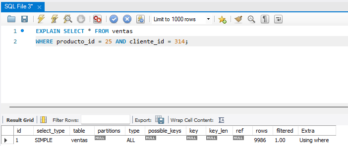
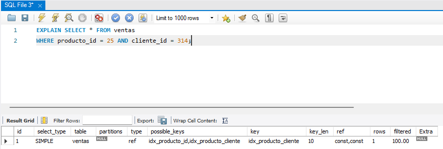

# Trabajo Práctico 1 - Base de Datos II  
## Ejercicio 5: Creación de Índices

### Objetivo

Diseñar una consulta que filtre por múltiples campos, crear diferentes índices y analizar cuál ofrece mejor rendimiento utilizando `EXPLAIN`.

---

### 1. Creación de la tabla

```sql
CREATE TABLE ventas (
    id INT AUTO_INCREMENT PRIMARY KEY,
    producto_id INT,
    cliente_id INT,
    fecha DATE,
    cantidad INT
);
```

---

### 2. Inserción de datos (resumido)

```sql
INSERT INTO ventas (producto_id, cliente_id, fecha, cantidad)
VALUES (1, 101, '2024-01-10', 3),
       (1, 102, '2024-01-10', 2),
       (2, 101, '2024-01-11', 1),
       (2, 102, '2024-01-12', 4);
```

---

### 3. Consulta a optimizar

```sql
SELECT * FROM ventas
WHERE producto_id = 1 AND cliente_id = 101;
```

---

### 4. Análisis con `EXPLAIN` sin índice

```sql
EXPLAIN SELECT * FROM ventas
WHERE producto_id = 1 AND cliente_id = 101;
```

📸 Resultado sin índice:



---

### 5. Creación de índices

#### Índice individual

```sql
CREATE INDEX idx_producto ON ventas(producto_id);
```

#### Índice combinado

```sql
CREATE INDEX idx_producto_cliente ON ventas(producto_id, cliente_id);
```

---

### 6. Análisis con `EXPLAIN` con índice combinado

```sql
EXPLAIN SELECT * FROM ventas
WHERE producto_id = 1 AND cliente_id = 101;
```

📸 Resultado con índice combinado:



---

### Conclusión

El uso de un índice combinado en `(producto_id, cliente_id)` ofrece un mejor rendimiento al permitir al motor de base de datos evitar el escaneo completo de la tabla. Esto es especialmente útil cuando la cantidad de registros es alta y se filtra por múltiples columnas en conjunto.

