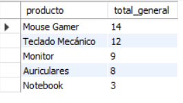

# Trabajo Práctico 1 - Base de Datos II  
## Ejercicio 5: Creación de Índices

### Objetivo

Crear una vista que resuma las ventas mensuales por producto. Luego, usarla en una consulta que devuelva los 5 productos más vendidos.

---

### 1. Creación de la tablas

```sql
CREATE TABLE productos (
  id INT PRIMARY KEY,
  nombre VARCHAR(100)
);

CREATE TABLE ventas (
  id INT AUTO_INCREMENT PRIMARY KEY,
  producto_id INT,
  cantidad INT,
  fecha_venta DATE,
  FOREIGN KEY (producto_id) REFERENCES productos(id)
);
```

---

### 2. Inserción de datos

```sql
INSERT INTO productos (id, nombre) VALUES
(1, 'Notebook'),
(2, 'Auriculares'),
(3, 'Mouse Gamer'),
(4, 'Monitor'),
(5, 'Teclado Mecánico');

INSERT INTO ventas (producto_id, cantidad, fecha_venta) VALUES
(1, 2, '2024-01-15'),
(2, 5, '2024-01-20'),
(2, 3, '2024-02-10'),
(3, 10, '2024-01-12'),
(3, 4, '2024-02-15'),
(1, 1, '2024-02-01'),
(4, 6, '2024-01-30'),
(4, 3, '2024-02-18'),
(5, 8, '2024-01-25'),
(5, 4, '2024-02-20');
```

---

### 3. Crear VIEW

```sql
create view ventas_mensuales AS
SELECT
	p.nombre AS producto,
	DATE_FORMAT(v.fecha_venta, '%Y-%m') AS mes,
    SUM(v.cantidad) AS total_vendido
FROM ventas v
JOIN producto p ON v.producto_id = p.id
GROUP BY p.nombre, mes;
```

---

### 4. Consultar los 5 productos más vendidos (en total)

```sql
SELECT 
  producto,
  SUM(total_vendido) AS total_general
FROM ventas_mensuales
GROUP BY producto
ORDER BY total_general DESC
LIMIT 5;
```

📸 Resultado:



---

