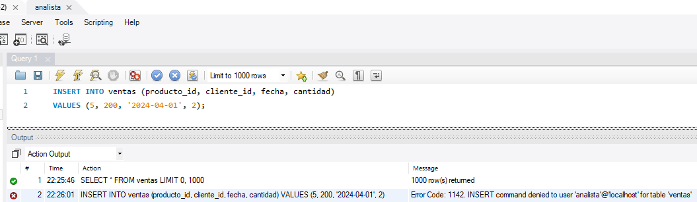

# Trabajo Práctico 1 - Base de Datos II  
## Ejercicio 7: Gestión de Permisos

### Objetivo

Crear un usuario con permisos restringidos que solo pueda realizar operaciones de lectura (`SELECT`) sobre ciertas tablas. Verificar el comportamiento al intentar realizar operaciones no permitidas como `INSERT`.

---

### 1. Creación del usuario analista

```sql
CREATE USER 'analista'@'localhost' IDENTIFIED BY 'Analista123!';
```

---

### 2. Asignación de permisos de solo lectura

```sql
GRANT SELECT ON nombre_de_tu_base_datos.ventas TO 'analista'@'localhost';
FLUSH PRIVILEGES;
```

> Reemplazar `nombre_de_tu_base_datos` por el nombre real de la base en uso.

---

### 3. Prueba de lectura con el nuevo usuario

Conectado como `analista`, ejecutar:

```sql
SELECT * FROM ventas;
```

✔️ La operación se realiza correctamente.

---

### 4. Prueba de escritura prohibida

Intentar insertar un nuevo registro:

```sql
INSERT INTO ventas (producto_id, cliente_id, fecha, cantidad)
VALUES (5, 200, '2024-04-01', 2);
```

🚫 Esta operación falla debido a falta de permisos.

📸 Captura del error:



---

### Conclusión

El usuario `analista` puede acceder a los datos pero no modificarlos, como fue definido en su política de permisos. Esto demuestra cómo el control granular de privilegios permite administrar el acceso de forma segura en entornos multiusuario.

