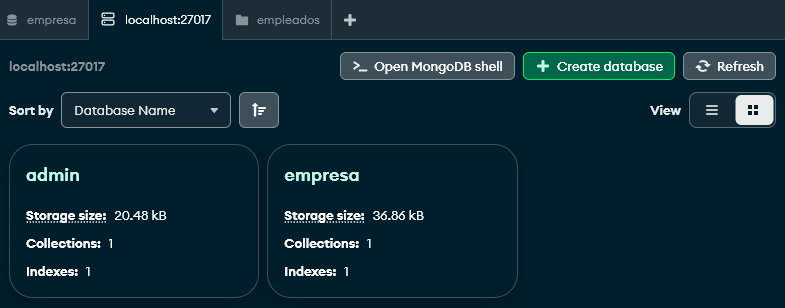
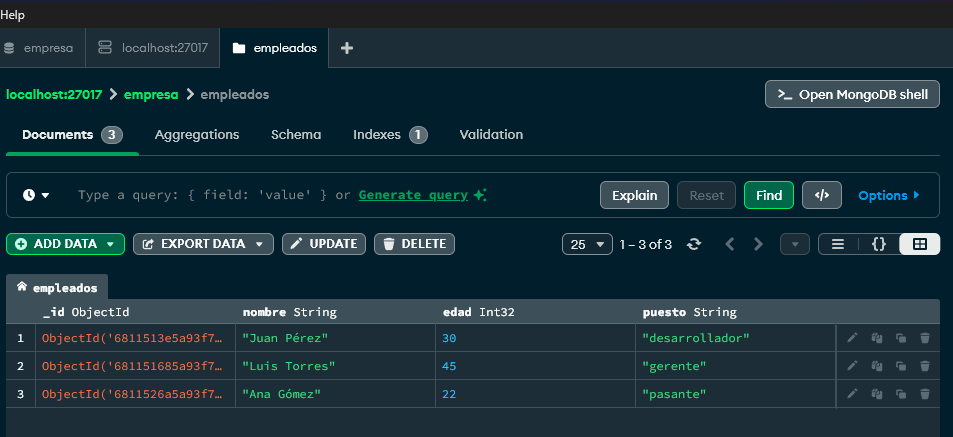
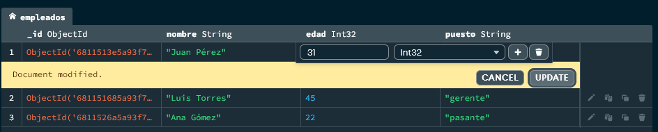
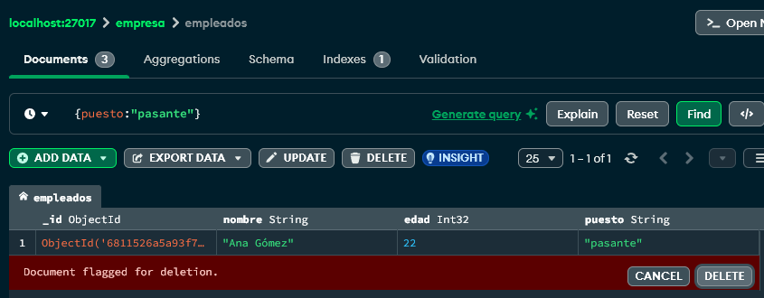
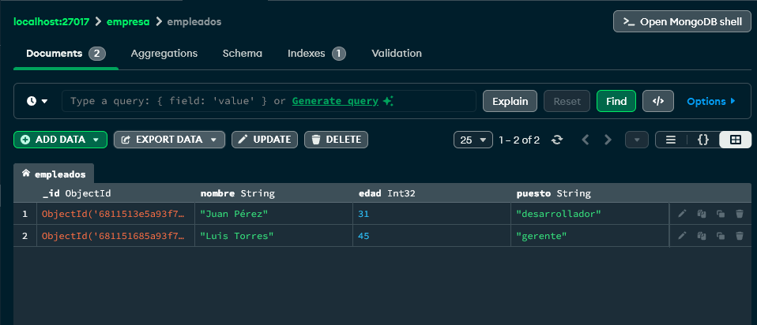

# Trabajo Práctico 2 - Base de Datos II
## MongoDB - Ejercicio 1: CRUD básico

---

### Paso 1: Crear base de datos y colección

Se creó la base de datos `empresa` y la colección `empleados`.

---

### Paso 2: Insertar 3 documentos

Se insertaron los siguientes empleados:

- Juan Pérez (30 años) - desarrollador
- Ana Gómez (22 años) - pasante
- Luis Torres (45 años) - gerente

---

### Paso 3: Actualizar la edad de un empleado

Se modificó la edad de Juan Pérez de 30 a 31 años.

---

### Paso 4: Eliminar al pasante

Se eliminó a Ana Gómez, que tenía el puesto de pasante.

---

### Paso 5: Verificación final

Se confirmó que sólo quedaron Juan Pérez y Luis Torres en la colección.

---
