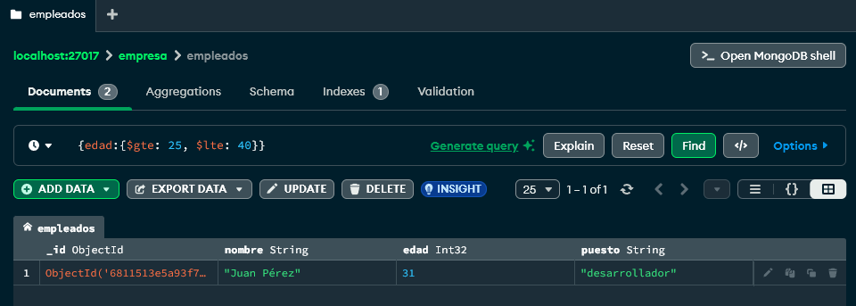

# Trabajo Práctico 2 - Base de Datos II
## MongoDB - Ejercicio 2: Búsquedas con operadores

---

### Consigna

Consultar todos los empleados cuya edad esté entre 25 y 40 años. Utilizar operadores relacionales y lógicos.

---

### Consulta 1: Usando operadores relacionales

```json
{ "edad": { "$gte": 25, "$lte": 40 } }
```

---

### Consulta 2: Usando operadores lógicos

```json
{
  "$and": [
    { "edad": { "$gte": 25 } },
    { "edad": { "$lte": 40 } }
  ]
}
```

---

### Resultado esperado

Deberían listarse solo los empleados cuya edad esté dentro del rango 25–40.



---
