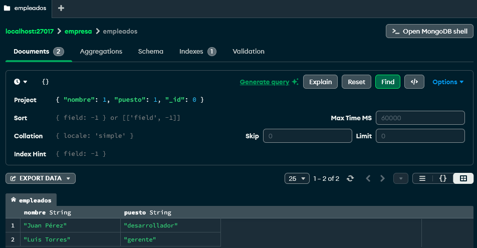

# Trabajo Práctico 2 - Base de Datos II
## MongoDB - Ejercicio 3: Uso de proyección

---

### Consigna

Recuperar los nombres y puestos de todos los empleados, sin mostrar el campo `_id`.

---

### Consulta realizada

**Filtro (Find):**

```json
{}
```

**Proyección (Project):**

```json
{ "nombre": 1, "puesto": 1, "_id": 0 }
```

---

### Resultado esperado

Se deben listar únicamente los campos:

- `nombre`
- `puesto`

El campo `_id` no debe aparecer en el resultado.

---

Resultado de la consulta con la proyección aplicada.



---
