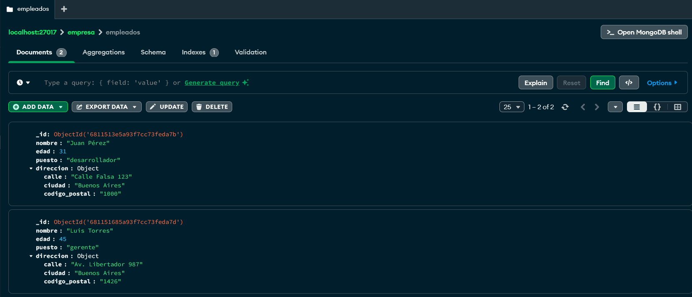

# Trabajo Práctico 2 - Base de Datos II
## MongoDB - Ejercicio 4: Documentos embebidos

---

### Consigna

Agregar un campo `direccion` a cada empleado, que contenga:

- `calle`
- `ciudad`
- `codigo_postal`

---

### Modificación realizada

Se editó cada documento de la colección `empleados`, agregando el nuevo campo embebido `direccion` con la siguiente estructura:

```json
"direccion": {
  "calle": "Calle Falsa 123",
  "ciudad": "Buenos Aires",
  "codigo_postal": "1000"
}
```

---

### Ejemplo de documentos finales

```json
{
  "nombre": "Juan Pérez",
  "edad": 31,
  "puesto": "desarrollador",
  "direccion": {
    "calle": "Calle Falsa 123",
    "ciudad": "Buenos Aires",
    "codigo_postal": "1000"
  }
}
```

```json
{
  "nombre": "Luis Torres",
  "edad": 45,
  "puesto": "gerente",
  "direccion": {
    "calle": "Av. Libertador 987",
    "ciudad": "Buenos Aires",
    "codigo_postal": "1426"
  }
}
```

---
