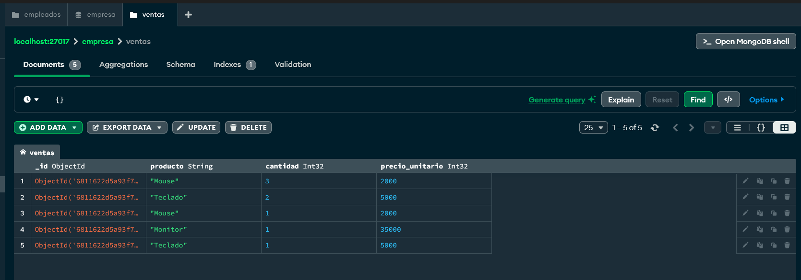
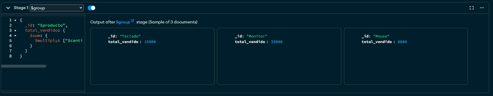

# Trabajo Práctico 2 - Base de Datos II
## MongoDB - Ejercicio 5: Agregación

---

### Consigna

Dada una colección `ventas` con los campos `producto`, `cantidad` y `precio_unitario`, calcular el total de ventas por producto utilizando `$group` y `$sum`.

---

### Inserción de documentos

Se creó la colección `ventas` con los siguientes documentos:

```json
[
  { "producto": "Mouse", "cantidad": 3, "precio_unitario": 2000 },
  { "producto": "Teclado", "cantidad": 2, "precio_unitario": 5000 },
  { "producto": "Mouse", "cantidad": 1, "precio_unitario": 2000 },
  { "producto": "Monitor", "cantidad": 1, "precio_unitario": 35000 },
  { "producto": "Teclado", "cantidad": 1, "precio_unitario": 5000 }
]
```

---

### Pipeline de agregación utilizado

```json
{
  "_id": "$producto",
  "total_vendido": {
    "$sum": {
      "$multiply": [ "$cantidad", "$precio_unitario" ]
    }
  }
}
```
---

### Resultado esperado

```json
[
  { "_id": "Mouse", "total_vendido": 8000 },
  { "_id": "Teclado", "total_vendido": 15000 },
  { "_id": "Monitor", "total_vendido": 35000 }
]
```

---
