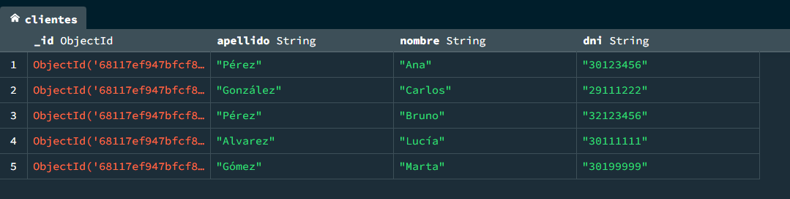
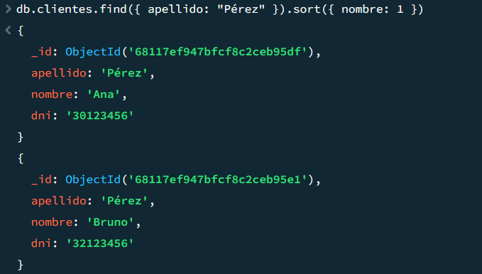

# Trabajo Práctico 2 - Base de Datos II
## MongoDB - Ejercicio 6: Índice Compuesto

---

### Consigna

Crea un `índice compuesto` sobre los campos `apellido` y `nombre` en una colección de clientes

---

### Inserción de documentos

Se creó la colección `clientes` con los siguientes documentos:

```json
[
  { "apellido": "Pérez", "nombre": "Ana", "dni": "30123456" },
  { "apellido": "González", "nombre": "Carlos", "dni": "29111222" },
  { "apellido": "Pérez", "nombre": "Bruno", "dni": "32123456" },
  { "apellido": "Alvarez", "nombre": "Lucía", "dni": "30111111" },
  { "apellido": "Gómez", "nombre": "Marta", "dni": "30199999" }
]
```

---

### Creación de Índice Compuesto


---

### Resultado esperado



---