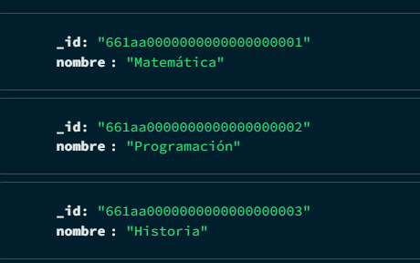
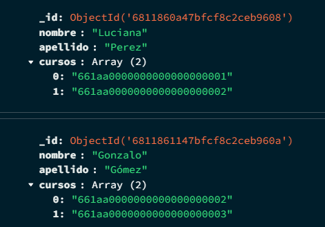

# Trabajo Práctico 2 - Base de Datos II
## MongoDB - Ejercicio 7: Referencias

---

### Consigna

Crear una colección `cursos` y una colección `alumnos`. Luego, insertar documentos donde los alumnos tengan una lista de `id_curso` referenciando a los cursos.

---

### Inserción de documentos Cursos

Se creó la colección `cursos` con los siguientes documentos:

```json
[
  { "_id": "661aa0000000000000000001", "nombre": "Matemática" },
  { "_id": "661aa0000000000000000002", "nombre": "Programación" },
  { "_id": "661aa0000000000000000003", "nombre": "Historia" }
]

```

---

### Inserción de documentos Alumnos

Se creó la colección `Alumnos` con los siguientes documentos:

```json
{
  "nombre": "Lucía",
  "apellido": "Pérez",
  "cursos": [
    "661aa0000000000000000001",
    "661aa0000000000000000002"
  ]
}
```

```json
{
  "nombre": "Bruno",
  "apellido": "Gómez",
  "cursos": [
    "661aa0000000000000000002",
    "661aa0000000000000000003"
  ]
}
```

---
