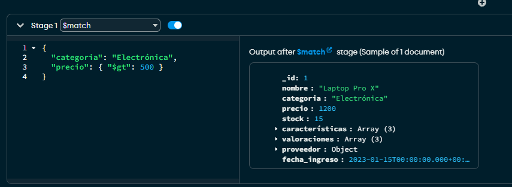
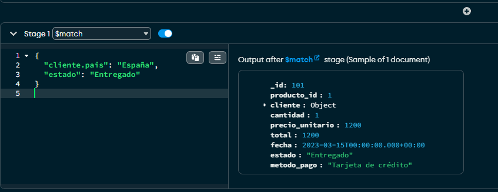

# Trabajo Práctico: Agregación en MongoDB

## Ejercicio 1: Filtrado básico con `$match`

---

### 🔍 Consulta 1: Productos electrónicos con precio > 500

```js
db.productos.aggregate([
  {
    $match: {
      categoria: "Electrónica",
      precio: { $gt: 500 }
    }
  }
])
```

📌 **Explicación**: Se buscan los productos que pertenecen a la categoría "Electrónica" y tienen un precio mayor a 500.



---

### 🔍 Consulta 2: Ventas a clientes de España con estado "Entregado"

```js
db.ventas.aggregate([
  {
    $match: {
      "cliente.pais": "España",
      estado: "Entregado"
    }
  }
])
```

📌 **Explicación**: Se filtran las ventas realizadas a clientes cuyo país es "España" y el estado de la venta es "Entregado".



---

✅ Ambas consultas se pueden ejecutar en MongoDB Compass o desde el panel de MongoDB en Visual Studio Code.
