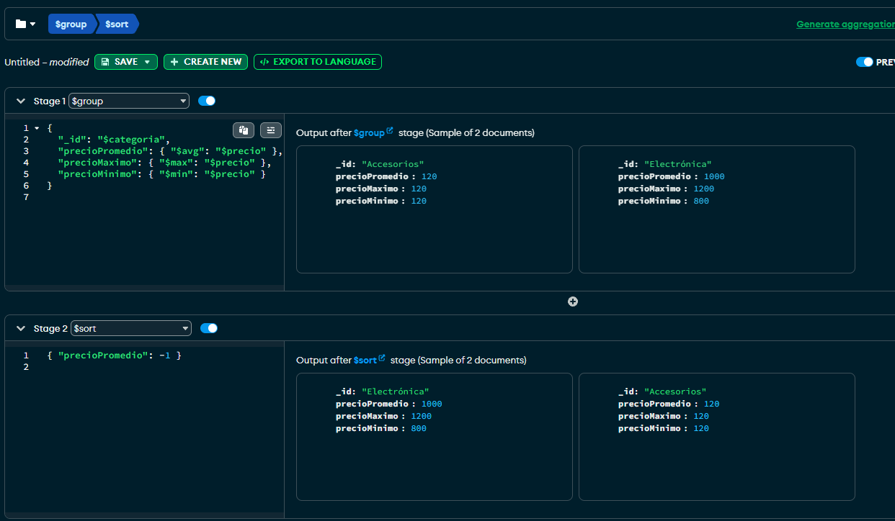
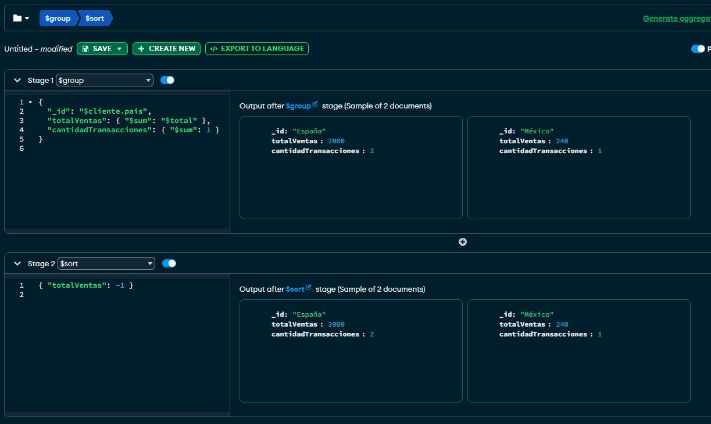

# Trabajo Práctico: Agregación en MongoDB

## Ejercicio 2: Agrupación y agregación con `$group` y `$sort`

---

### 🔍 Consulta 1: Precio promedio, máximo y mínimo por categoría de producto

```js
db.productos.aggregate([
  {
    $group: {
      _id: "$categoria",
      precioPromedio: { $avg: "$precio" },
      precioMaximo: { $max: "$precio" },
      precioMinimo: { $min: "$precio" }
    }
  },
  {
    $sort: { precioPromedio: -1 }
  }
])
```

📌 **Explicación**:  
Agrupa los productos por categoría, calcula el precio promedio, el más alto y el más bajo de cada grupo. Luego ordena de mayor a menor según el promedio.

📷 Resultado:



---

### 🔍 Consulta 2: Total de ventas por país del cliente

```js
db.ventas.aggregate([
  {
    $group: {
      _id: "$cliente.pais",
      totalVentas: { $sum: "$total" },
      cantidadTransacciones: { $sum: 1 }
    }
  },
  {
    $sort: { totalVentas: -1 }
  }
])
```

📌 **Explicación**:  
Agrupa las ventas por país del cliente, calcula el total vendido y cuántas transacciones hubo por país. Luego ordena por mayor total de ventas.

📷 Resultado:


