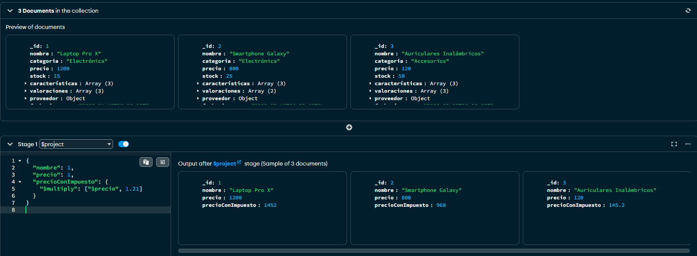
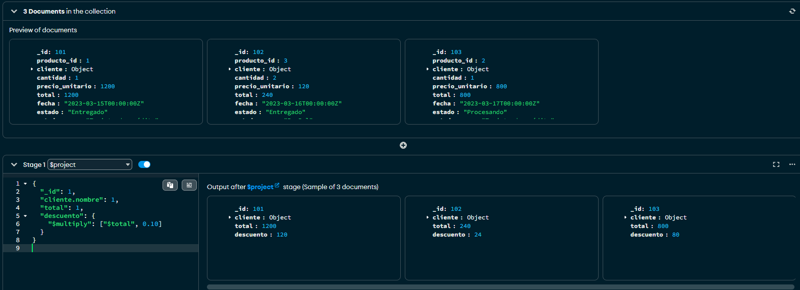

# Trabajo Práctico: Agregación en MongoDB

## Ejercicio 3: Transformación de documentos con `$project`

---

### 🔍 Consulta 1: Productos con `precioConImpuesto`

```js
db.productos.aggregate([
  {
    $project: {
      nombre: 1,
      precio: 1,
      precioConImpuesto: {
        $multiply: ["$precio", 1.21]
      }
    }
  }
])
```

📌 **Explicación**:  
Se seleccionan los campos `nombre` y `precio`, y se agrega un nuevo campo `precioConImpuesto` que resulta de multiplicar el precio por 1.21 (IVA 21%).

📷 Resultado:



---

### 🔍 Consulta 2: Ventas con `descuento`

```js
db.ventas.aggregate([
  {
    $project: {
      _id: 1,
      "cliente.nombre": 1,
      total: 1,
      descuento: {
        $multiply: ["$total", 0.10]
      }
    }
  }
])
```

📌 **Explicación**:  
Se proyecta el ID, el nombre del cliente y el total de la venta. Se añade un campo `descuento` que representa el 10% del total.

📷 Resultado:


