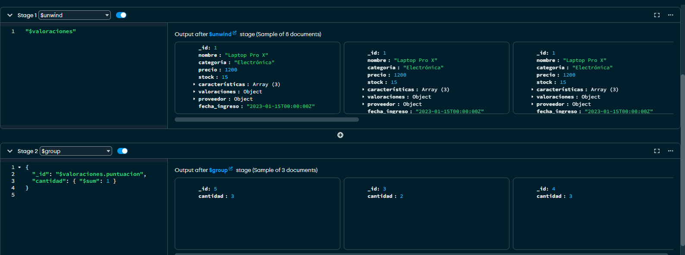
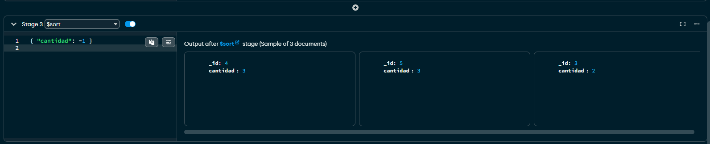

# Trabajo Práctico: Agregación en MongoDB

## Ejercicio 4: Deconstrucción de arrays con `$unwind`

---

### 🔍 Objetivo

Deconstruir el array de `valoraciones` de cada producto para trabajar con cada valoración por separado, luego agruparlas por `puntuacion` y contar cuántas hay de cada una.

---

### 💻 Pipeline completo:

```js
db.productos.aggregate([
  {
    $unwind: "$valoraciones"
  },
  {
    $group: {
      _id: "$valoraciones.puntuacion",
      cantidad: { $sum: 1 }
    }
  },
  {
    $sort: { cantidad: -1 }
  }
])
```

📌 **Explicación**:
- `$unwind` separa cada `valoracion` en un documento distinto.
- `$group` agrupa por el campo `puntuacion` de cada valoración.
- `$sum: 1` cuenta cuántas valoraciones tiene cada puntuación.
- `$sort` ordena de mayor a menor.

📷 Resultado:


