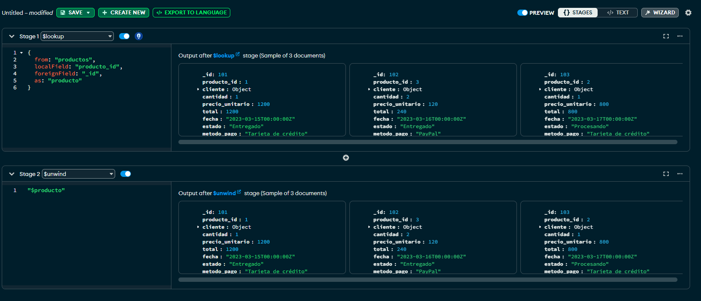

# Trabajo Práctico: Agregación en MongoDB

## Ejercicio 5: Combinación de colecciones con `$lookup`

---

### 🔍 Consulta 1: Enriquecer ventas con información del producto

```js
db.ventas.aggregate([
  {
    $lookup: {
      from: "productos",
      localField: "producto_id",
      foreignField: "_id",
      as: "producto"
    }
  },
  {
    $unwind: "$producto"
  }
])
```

📌 **Explicación**:
- `$lookup` hace un join entre `ventas` y `productos` usando `producto_id` y `_id`.
- Se guarda la info en un array llamado `producto`.
- `$unwind` aplana ese array para poder acceder directamente a los campos del producto.

📷 Resultado:



---

### 🔍 Consulta 2: Total vendido por categoría del producto

```js
db.ventas.aggregate([
  {
    $lookup: {
      from: "productos",
      localField: "producto_id",
      foreignField: "_id",
      as: "producto"
    }
  },
  {
    $unwind: "$producto"
  },
  {
    $group: {
      _id: "$producto.categoria",
      totalVendido: { $sum: "$total" }
    }
  }
])
```

📌 **Explicación**:
- Una vez que cada venta está unida a su producto, agrupamos por `producto.categoria`.
- Sumamos el total de las ventas por cada categoría.

📷 Resultado:


